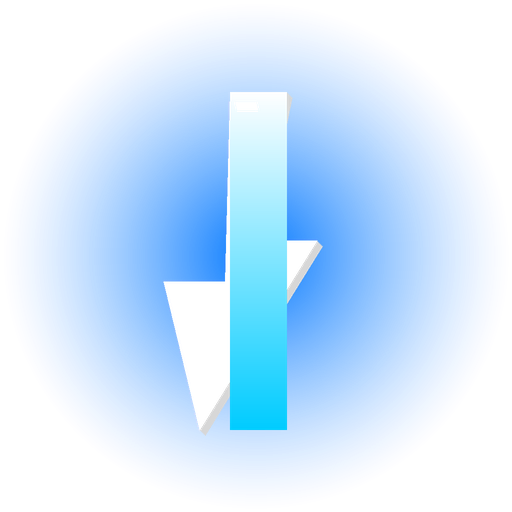

# Nova AI Assistant

<p align="center">
  
</p>

<p align="center">
  <a href="https://www.electronjs.org/"></a>
  <a href="https://nodejs.org/"></a>
  <a href="https://github.com/" ></a>
</p>

Cross-platform AI assistant desktop app scaffolding for macOS (Universal) and Windows.

## 구조

### 프론트엔드

- `design/` - UI 화면 및 디자인 프로토타입 HTML
- `assets/` - 앱 아이콘, 이미지 리소스

### 백엔드

- `main.js` - Electron 메인 프로세스, 앱 라이프사이클 및 윈도우 생성
- `preload.js` - 안전한 렌더러-메인 브리지
- `ai-models.js` - AI 모델 API 호출 및 데이터 처리 로직
- `package.json` - 실행/패키징 스크립트, 종속성, 빌드 설정

## 실행 방법

```bash
cd ./-Nova-AI-Assistant
npm install
npm run start
```

## 빌드 방법

```bash
npm run dist
```

빌드 결과는 `dist/` 폴더에 생성됩니다.

## 아이콘 파일

- `assets/icon-1024.png`
- `assets/icon-512.png`
- `assets/icon.png`
- `assets/icon.ico`
- `assets/icon.icns`
- `assets/icon.svg`

macOS 패키징에는 `assets/icon.icns`, Windows 패키징에는 `assets/icon.ico`를 사용합니다.

## 참고

기존 디자인 화면은 `design/Dashboard.html`, `design/workspace.html`, `design/setting.html`에서 확인할 수 있습니다.
